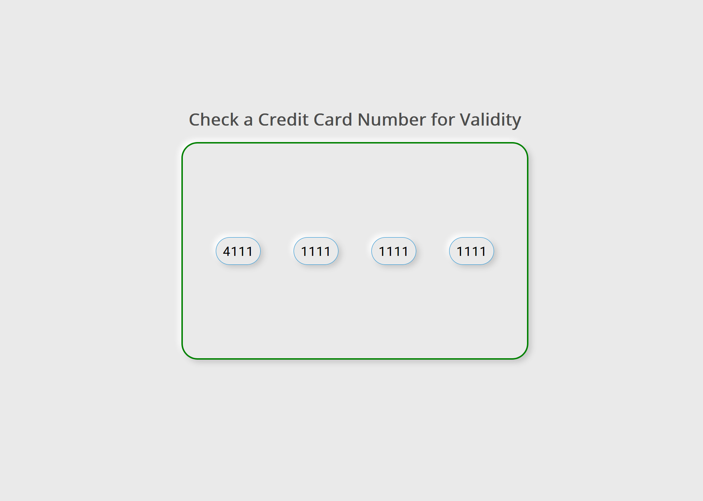

# Credit Card Validator

Input a Visa/MasterCard number to check if it is valid. The feedback can immediately seen by the color of the credit card on screen.

The style used is pseudo-neumorphic. True neumorphic design may be beautiful but it is also problematic in terms of UX. I experimented with the design until I felt it looked good while still adhering to accessibility guidelines.

